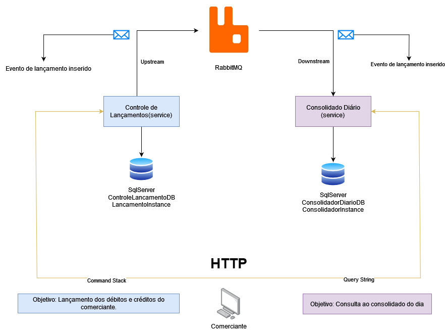

# README - Projetos Controle de Lançamentos e Consolidador Diário

Este é o README dos projetos **Controle de Lançamentos** e **Consolidador Diário**, duas aplicações desenvolvidas em C# utilizando o framework .NET 7. Este documento fornecerá uma visão geral de cada projeto, suas tecnologias, estrutura e bibliotecas utilizadas, além de instruções para executar e testar os projetos, incluindo a configuração do ambiente com Docker Compose.

## Arquitetura Utilizada



## Projeto 1 - Controle de Lançamentos

### Visão Geral

O projeto **Controle de Lançamentos** é uma aplicação voltada para o gerenciamento de lançamentos financeiros. Com linguagem C# e o framework .NET 7, este projeto oferece uma arquitetura robusta e organizada.

### Estrutura da API

A estrutura da API do Controle de Lançamentos está dividida em camadas bem definidas:

- **Domínio**: A camada de domínio contém as entidades e regras de negócio da aplicação. É o coração do sistema, onde são definidos os conceitos fundamentais do Controle de Lançamentos.

- **Aplicação / Casos de Uso**: Aqui, são implementados os casos de uso da aplicação, encapsulando a lógica de negócio e fornecendo uma interface para a camada de Controllers.

- **Controllers**: Esta camada é responsável por lidar com as requisições HTTP, roteando-as para os casos de uso apropriados e retornando as respostas adequadas.

- **Infraestrutura**: Aqui, encontramos as implementações concretas, como acesso a banco de dados, serviços externos e outras dependências.

- **Migrations**: Esta pasta contém as migrações do Entity Framework, permitindo a evolução do banco de dados de forma controlada e consistente.

### Estrutura dos Testes

Os testes no projeto Controle de Lançamentos estão organizados nas seguintes camadas:

- **Domínio**: Os testes de domínio garantem que as entidades e regras de negócio estão funcionando conforme o esperado, proporcionando alta confiabilidade para o núcleo da aplicação.

- **Aplicação / Casos de Uso**: Os testes de casos de uso validam a lógica de negócio da aplicação, assegurando que os casos de uso estejam corretamente implementados e funcionando de acordo com as especificações.

### Bibliotecas Utilizadas

- **Microsoft.EntityFrameworkCore.SqlServer**: Utilizada para gerenciar o acesso a dados com o SQL Server, garantindo uma persistência robusta e eficiente.

- **MassTransit.RabbitMQ**: Esta biblioteca é empregada para a comunicação entre microserviços por meio de mensagens, garantindo escalabilidade e desacoplamento.

- **Moq**: É uma biblioteca de mocking que facilita a criação de objetos simulados para testes unitários, permitindo uma cobertura completa dos testes.


## Projeto 2 - Consolidador Diário

### Visão Geral

O projeto **Consolidador Diário** é uma aplicação C# desenvolvida no framework .NET 7, com o propósito de consolidar dados diários de várias fontes em uma base de dados central.

### Estrutura da API

A estrutura da API do Consolidador Diário segue os mesmos princípios do projeto Controle de Lançamentos:

- **Domínio**: A camada de domínio contém as entidades e regras de negócio da aplicação. É o coração do sistema, onde são definidos os conceitos fundamentais do Controle de Lançamentos.

- **Aplicação / Casos de Uso**: Aqui, são implementados os casos de uso da aplicação, encapsulando a lógica de negócio e fornecendo uma interface para a camada de Controllers.

- **Controllers**: Esta camada é responsável por lidar com as requisições HTTP, roteando-as para os casos de uso apropriados e retornando as respostas adequadas.

- **Infraestrutura**: Aqui, encontramos as implementações concretas, como acesso a banco de dados, serviços externos e outras dependências.

- **Migrations**: Esta pasta contém as migrações do Entity Framework, permitindo a evolução do banco de dados de forma controlada e consistente.

### Bibliotecas Utilizadas

- **Microsoft.EntityFrameworkCore.SqlServer**: Utilizada para gerenciar o acesso a dados com o SQL Server, garantindo uma persistência robusta e eficiente.

- **MassTransit.RabbitMQ**: Esta biblioteca é empregada para a comunicação entre microserviços por meio de mensagens, garantindo escalabilidade e desacopla

## Como Iniciar

Para iniciar o projeto, siga os seguintes passos:

1. Certifique-se de que possui o SDK .NET 7 instalado em sua máquina.

2. Clone este repositório.

   ```
   git clone https://github.com/andersondom/RotinaBanco.git
   ```

## Configuração do Ambiente com Docker Compose

Para simplificar a configuração do ambiente, ambos os projetos estão configurados no Docker Compose. Certifique-se de ter o Docker e o Docker Compose instalados.

1. Navegue até a raiz do projeto e execute o seguinte comando para construir as imagens Docker:

   ```bash
   docker-compose up
   ```

Isso iniciará os serviços dos bancos de dados SQL Server e RabbitMQ necessários para os projetos.

Esperamos que este README forneça uma visão clara dos projetos Controle de Lançamentos e Consolidador Diário, e facilite a avaliação e execução dos mesmos. Se você tiver alguma dúvida ou precisar de assistência adicional, não hesite em entrar em contato com a equipe de desenvolvimento.