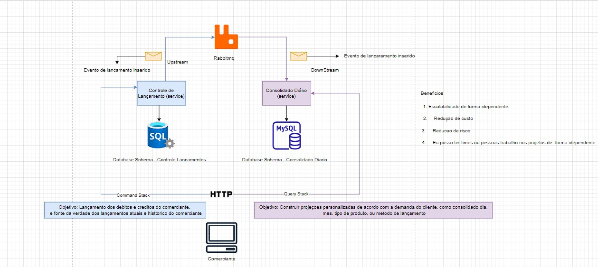

# Controle de Lançamentos

Este é o repositório do projeto Controle de Lançamentos, uma aplicação desenvolvida em C# com o framework .NET 7. O objetivo deste projeto é proporcionar um controle eficiente de lançamentos financeiros, oferecendo uma estrutura sólida e bem organizada para facilitar o desenvolvimento, manutenção e testes.

## Visão Geral


## Estrutura do Projeto

A estrutura deste projeto segue as melhores práticas de arquitetura de software, dividindo-o em diferentes camadas:

### Estrutura da API

- **Domínio**: A camada de domínio contém as entidades e regras de negócio da aplicação. É o coração do sistema, onde são definidos os conceitos fundamentais do Controle de Lançamentos.

- **Aplicação / Casos de Uso**: Aqui, são implementados os casos de uso da aplicação, encapsulando a lógica de negócio e fornecendo uma interface para a camada de Controllers.

- **Controllers**: Esta camada é responsável por lidar com as requisições HTTP, roteando-as para os casos de uso apropriados e retornando as respostas adequadas.

- **Infraestrutura**: Aqui, encontramos as implementações concretas, como acesso a banco de dados, serviços externos e outras dependências.

- **Migrations**: Esta pasta contém as migrações do Entity Framework, permitindo a evolução do banco de dados de forma controlada e consistente.

### Estrutura dos Testes

- **Domínio**: Os testes de domínio garantem que as entidades e regras de negócio estão funcionando conforme o esperado, proporcionando alta confiabilidade para o núcleo da aplicação.

- **Aplicação / Casos de Uso**: Os testes de casos de uso validam a lógica de negócio da aplicação, assegurando que os casos de uso estejam corretamente implementados e funcionando de acordo com as especificações.

## Bibliotecas Utilizadas

- **Microsoft.EntityFrameworkCore.SqlServer**: Utilizada para gerenciar o acesso a dados com o SQL Server, garantindo uma persistência robusta e eficiente.

- **MassTransit.RabbitMQ**: Esta biblioteca é empregada para a comunicação entre microserviços por meio de mensagens, garantindo escalabilidade e desacoplamento.

- **Moq**: É uma biblioteca de mocking que facilita a criação de objetos simulados para testes unitários, permitindo uma cobertura completa dos testes.

## Como Iniciar

Para iniciar o projeto, siga os seguintes passos:

1. Certifique-se de que possui o SDK .NET 7 instalado em sua máquina.

2. Clone este repositório.

   ```
   git clone https://github.com/seu-usuario/controle-lancamentos.git
   ```

3. Navegue até o diretório do projeto.

   ```
   cd controle-lancamentos
   ```

4. Execute o projeto utilizando o Docker Compose para iniciar os contêineres necessários de infraestrutura como SQLSERVER e RABBIT.

   ```
   docker-compose up
   ```

5. Acesse a API em [http://localhost:5000](http://localhost:5000).


Esperamos que este README tenha fornecido uma visão geral clara e motivadora do projeto Controle de Lançamentos. Se você tiver alguma dúvida ou precisar de mais informações, não hesite em entrar em contato conosco. Estamos ansiosos para colaborar e tornar este projeto um sucesso!